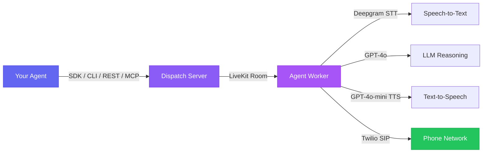

---
hide:
  - navigation
  - toc
  - footer
---

<style>
  .md-typeset h1 { display: none; }
  .md-content__inner { max-width: 100%; padding: 0; }
  .md-content { max-width: 100%; }
</style>

<div class="cu-landing" markdown>

<!-- ==================== HERO ==================== -->

<section class="cu-hero" markdown>

[:octicons-star-fill-24: Open Source -- Star on GitHub](https://github.com/agent-next/call-use){ .cu-hero__badge }

# Give your AI agent the ability to <span class="cu-gradient-text">make phone calls</span> { .cu-hero__heading }

<p class="cu-hero__desc">
call-use is an open-source runtime that lets any AI agent dial outbound calls,
navigate IVRs, hold conversations, and report structured results.
Three lines of Python. That's it.
</p>

<div class="cu-hero__actions" markdown>

[Get Started](getting-started/index.md){ .cu-btn .cu-btn--primary }
[View on GitHub :octicons-mark-github-16:](https://github.com/agent-next/call-use){ .cu-btn .cu-btn--secondary }

</div>

<div class="cu-install">
<span class="cu-install__prompt">$</span>
<span class="cu-install__cmd">pip install call-use</span>
</div>

<div class="cu-hero-video">
<video autoplay loop muted playsinline style="width: 100%; max-width: 960px; border-radius: 16px; box-shadow: 0 25px 60px rgba(0,0,0,0.3);">
<source src="assets/demo.mp4" type="video/mp4">
</video>
</div>

<div class="cu-hero-code" markdown>

```python
from call_use import CallAgent

outcome = await CallAgent(phone="+18001234567", instructions="Cancel my subscription", approval_required=False).call()
print(outcome.disposition)  # "completed"
```

</div>

</section>

<!-- ==================== FEATURES ==================== -->

<section class="cu-section" markdown>

<p class="cu-section-title">Why call-use?</p>
<p class="cu-section-subtitle">
Everything you need to give your agents phone superpowers, nothing you don't.
</p>

<div class="grid cards" markdown>

-   :material-phone-outgoing:{ .cu-card-icon } **Outbound Calls**

    ---

    Dial any phone number via Twilio SIP trunk through LiveKit. Your agent talks to real people and real IVR systems.

-   :material-code-braces:{ .cu-card-icon } **3 Lines of Code**

    ---

    Create an agent, give it a phone number and instructions, call. Get back a structured result with transcript, events, and disposition.

-   :material-swap-horizontal:{ .cu-card-icon } **Human Takeover**

    ---

    Pause the AI mid-call and take over the conversation yourself. Resume AI control when you're done. Full flexibility.

-   :material-shield-check:{ .cu-card-icon } **Approval Flow**

    ---

    Agent asks for human sign-off before taking sensitive actions. Built-in safety for high-stakes calls.

-   :material-layers-outline:{ .cu-card-icon } **4 Interfaces**

    ---

    Python SDK, CLI, REST API, and MCP Server. Use call-use however your stack needs it.

-   :material-open-source-initiative:{ .cu-card-icon } **Fully Open Source**

    ---

    MIT licensed. Self-host on your own infrastructure. No vendor lock-in, no per-call fees from us.

</div>

</section>

<!-- ==================== INTERFACES ==================== -->

<section class="cu-section" markdown>

<p class="cu-section-title">Choose your interface</p>
<p class="cu-section-subtitle">
Four ways to integrate. Pick the one that fits your workflow.
</p>

<div class="cu-interfaces" markdown>

=== ":material-language-python: Python SDK"

    ```python
    import asyncio
    from call_use import CallAgent

    async def main():
        agent = CallAgent(
            phone="+18001234567",
            instructions="Ask about store hours",
            approval_required=False,
        )
        outcome = await agent.call()
        print(f"Done: {outcome.disposition.value}")
        print(f"Transcript: {outcome.transcript}")

    asyncio.run(main())
    ```

=== ":material-console: CLI"

    ```bash
    # Simple call
    call-use dial "+18001234567" -i "Ask about store hours"

    # With human takeover enabled
    call-use dial "+18001234567" -i "Cancel my subscription" --takeover
    ```

=== ":material-server: MCP Server"

    ```json
    {
      "mcpServers": {
        "call-use": {
          "command": "call-use-mcp",
          "env": {
            "LIVEKIT_URL": "wss://your-project.livekit.cloud",
            "LIVEKIT_API_KEY": "your-api-key",
            "LIVEKIT_API_SECRET": "your-api-secret",
            "SIP_TRUNK_ID": "your-trunk-id",
            "OPENAI_API_KEY": "sk-..."
          }
        }
      }
    }
    ```

=== ":material-api: REST API"

    ```bash
    # Start a call
    curl -X POST http://localhost:8000/calls \
      -H "X-API-Key: your-key" \
      -H "Content-Type: application/json" \
      -d '{
        "phone_number": "+18001234567",
        "instructions": "Ask about store hours"
      }'

    # Check call status
    curl http://localhost:8000/calls/{call_id} \
      -H "X-API-Key: your-key"
    ```

</div>

</section>

<!-- ==================== COMPARISON ==================== -->

<section class="cu-section" markdown>

<p class="cu-section-title">How it compares</p>
<p class="cu-section-subtitle">
Stop building phone infrastructure from scratch. Stop paying per-call SaaS fees.
</p>

<div class="cu-comparison" markdown>

| | **call-use** | **Build from scratch** | **Pine AI** |
|---|:---:|:---:|:---:|
| Make a phone call | **3 lines** | months | sign up + $$$ |
| IVR navigation | built-in | weeks of work | built-in |
| Live transcript | built-in | weeks of work | built-in |
| Human takeover | built-in | weeks of work | -- |
| Approval flow | built-in | days of work | -- |
| Open source | **yes** | n/a | no |
| Self-hostable | **yes** | n/a | no |
| Any agent framework | **yes** | n/a | no |
| MCP server | **built-in** | n/a | no |

</div>

</section>

<!-- ==================== WORKS WITH ==================== -->

<section class="cu-section" markdown>

<p class="cu-section-title">Works with everything</p>
<p class="cu-section-subtitle">
Plug call-use into any agent framework or use it standalone.
</p>

<div class="grid" markdown>

:simple-anthropic:{ .cu-fw-icon } **Claude Code**
{ .cu-works-with__item }

:simple-langchain:{ .cu-fw-icon } **LangChain**
{ .cu-works-with__item }

:material-creation:{ .cu-fw-icon } **OpenAI Agents**
{ .cu-works-with__item }

:material-robot:{ .cu-fw-icon } **CrewAI**
{ .cu-works-with__item }

:material-console-line:{ .cu-fw-icon } **Any CLI Agent**
{ .cu-works-with__item }

</div>

</section>

<!-- ==================== ARCHITECTURE ==================== -->

<section class="cu-section" markdown>

<p class="cu-section-title">Architecture</p>
<p class="cu-section-subtitle">
Two-process design. The dispatch server handles API requests. The agent worker handles voice.
</p>

<div class="cu-architecture" markdown>



</div>

</section>

<!-- ==================== CTA ==================== -->

<section class="cu-cta" markdown>

## Ready to make your first call?

Install call-use, configure your credentials, and your agent will be making phone calls in minutes.

<div class="cu-install">
<span class="cu-install__prompt">$</span>
<span class="cu-install__cmd">pip install call-use</span>
</div>

[Read the docs](getting-started/index.md){ .cu-btn .cu-btn--primary }
[GitHub :octicons-mark-github-16:](https://github.com/agent-next/call-use){ .cu-btn .cu-btn--secondary }

</section>

</div>
